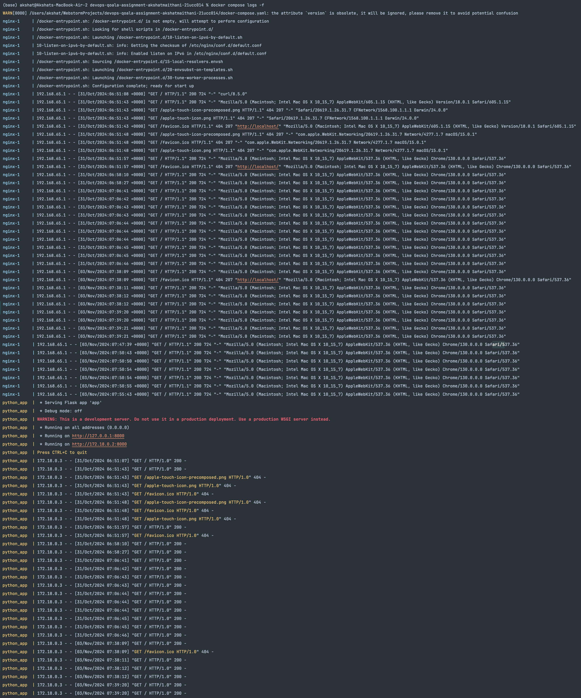
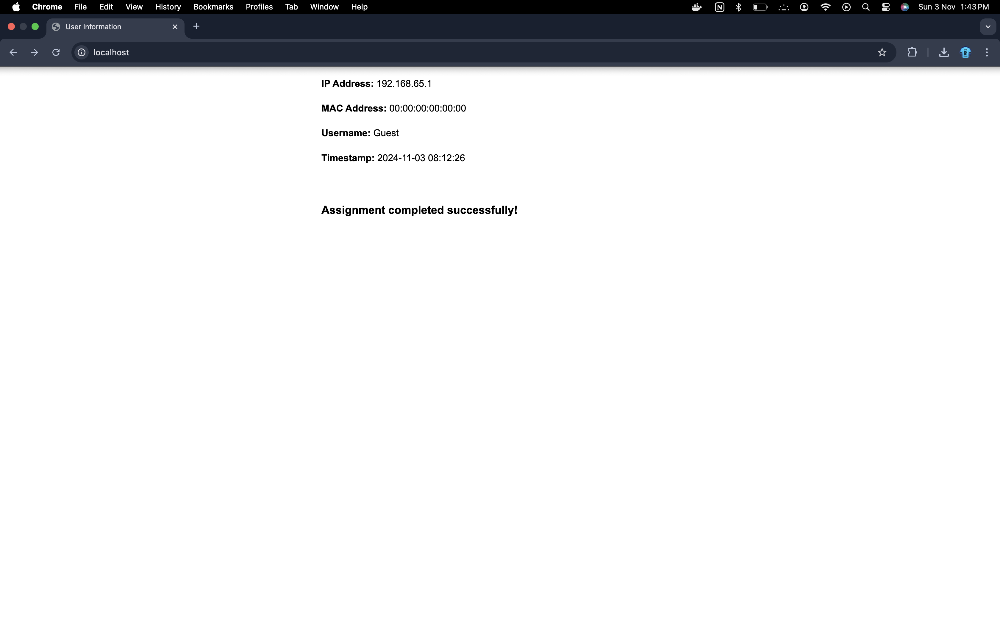

# Qoala DevOps Internship Assignment
## Debugging & Deployment Documentation

This documentation covers the debugging and deployment steps for a Dockerized application stack using Python (Flask) and Nginx. The project demonstrates the implementation of a reverse proxy setup with proper containerization.

## Table of Contents
- [Overview](#overview)
- [Key Issues and Resolutions](#key-issues-and-resolutions)
- [Deployment Steps](#deployment-steps)
- [Verification](#verification)
- [Logs](#logs)

## Cloud Deployment

The application is deployed on a cloud server and can be accessed at:

[http://ec2-3-110-191-228.ap-south-1.compute.amazonaws.com/](http://ec2-3-110-191-228.ap-south-1.compute.amazonaws.com/)

## Overview

The project consists of two main services:
1. A Python Flask application that displays system information
2. An Nginx reverse proxy server

## Key Issues and Resolutions

### 1. Python Application Dockerfile (`Python/Dockerfile`)

**Issues Found:**
- Incorrect file paths and WORKDIR
- Misconfigured package names
- Wrong port exposure format

**Resolutions:**
```dockerfile
# Before
WORKDIR /appp
COPY appy.py .
RUN pip install netiface
EXPOSE "eight thousand"

# After
WORKDIR /app
COPY app.py .
RUN pip install netifaces
EXPOSE 8000
```

### 2. Python Application Code (`app.py`)

**Issues Found:**
- Potential runtime errors in MAC address retrieval
- Inefficient user IP handling

**Resolutions:**
- Added error handling for interface MAC addresses
- Implemented X-Forwarded-For header support
- Enhanced HTML output formatting

### 3. Nginx Dockerfile (`nginx/Dockerfile`)

**Issues Found:**
- Incorrect base image specification
- Wrong file paths in COPY commands
- Misconfigured daemon directive

**Resolutions:**
```dockerfile
# Before
FROM nginx:1
COPY nginix.conf /etc/nginx/nginx.conf
EXPOSE "eighty"

# After
FROM nginx:latest
COPY nginx.conf /etc/nginx/nginx.conf
EXPOSE 80
```

### 4. Nginx Configuration (`nginx.conf`)

**Issues Found:**
- Typographical errors in directives
- Missing logging configuration

**Resolutions:**
- Corrected configuration syntax
- Added proper logging directives

### 5. Docker Compose File (`docker-compose.yaml`)

**Issues Found:**
- Incorrect volume mappings
- Missing network configuration

**Resolutions:**
```yaml
services:
  nginx:
    volumes:
      - ./nginx/nginx.conf:/etc/nginx/nginx.conf
    networks:
      - app-network
```

## Deployment Steps

1. Clone the repository:
```bash
git clone <repository-url>
cd <project-directory>
```

2. Build and start the containers:
```bash
docker compose up --build
```

## Verification

1. Access the application:
   - Open `http://localhost` in your browser
   - The Flask application should be accessible through the root endpoint
   - Direct Nginx access should show the static HTML page

2. Check container status:
```bash
docker compose ps
```

## Logs

### Nginx & Python Web App Logs



### Broswer Localhost

```
# Sample log output
[2024-11-03 10:15:23] INFO: Flask application started
```

## Contributing
If you find any issues or have suggestions for improvements, please feel free to open an issue or submit a pull request.
